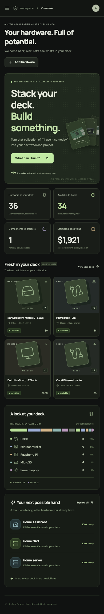
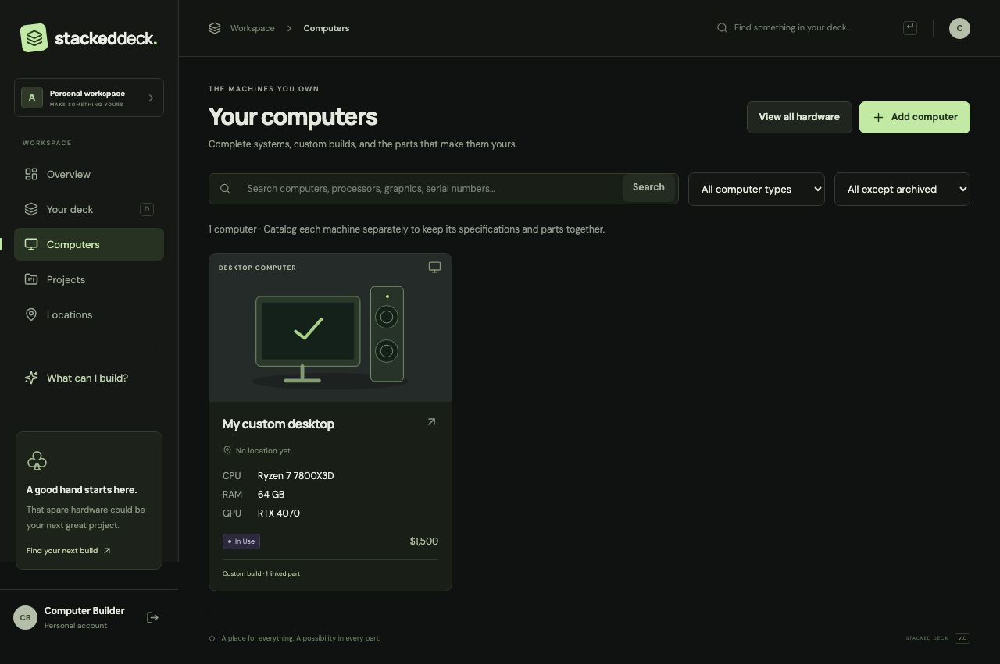
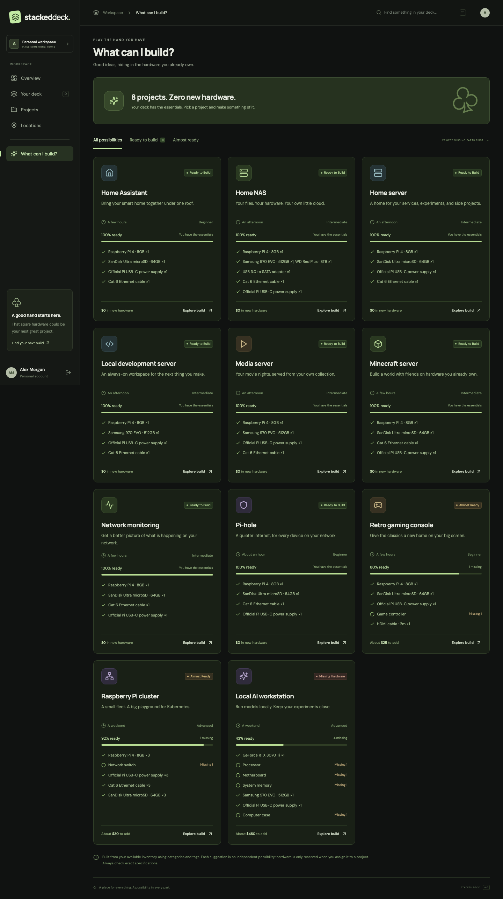
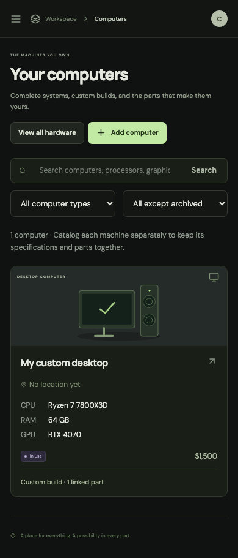

<div align="center">

# 🂡 Stacked Deck

### **Know what you own. Know what it's worth. Know what you can build.**

**A hardware inventory, build planner, and AI-powered gear tracker for people who have absolutely no idea which drawer they put that one adapter in.**

[](https://react.dev/)
[](https://www.typescriptlang.org/)
[](https://expressjs.com/)
[](https://sqlite.org/)
[](https://openai.com/)

<br />


<br />

**Inventory it. Scan it. Value it. Build with it.**

</div>

---

## ♠️ What is Stacked Deck?

At some point, a box of spare computer parts becomes **three boxes**.

Then you've got Raspberry Pis in a drawer, an old GPU in a closet, SSDs scattered across computers, six USB-C adapters that all look identical, and absolutely no clue whether you already own the thing you're about to buy on Amazon.

**Stacked Deck fixes that.**

Every piece of hardware becomes a card in your deck.

Track what you own, where it lives, what computer it's installed in, which projects are using it, what it's worth, and — most importantly — **what you can build with the hardware you already have.**

```text
             YOUR HARDWARE
                  │
        ┌─────────┴─────────┐
        ▼                   ▼
   INVENTORY            COMPUTERS
        │                   │
        └─────────┬─────────┘
                  ▼
              YOUR DECK
                  │
       ┌──────────┼──────────┐
       ▼          ▼          ▼
    PROJECTS   AI VALUE   LOCATIONS
       │          │          │
       └──────────┼──────────┘
                  ▼
          BUILD SOMETHING
```

---

# ♦️ The Good Stuff

## 📦 Hardware Inventory That Doesn't Suck

Track your gear with more than a sad spreadsheet.

Stacked Deck understands:

- CPUs
- GPUs
- RAM
- storage
- motherboards
- power supplies
- networking gear
- Raspberry Pis
- microcontrollers
- adapters
- peripherals
- complete computers
- custom hardware categories
- basically whatever weird tech you have accumulated

Each card can include:

**manufacturer · model · quantity · condition · status · serial number · purchase price · current value · location · tags · notes · image**

Search it. Filter it. Sort it. Actually find it again.

---

## 🤖 Point a Camera at Your Hardware

Don't feel like typing model numbers?

Good.

Take or upload a photo and let Stacked Deck analyze it.

The AI hardware scanner can pull details such as:

- hardware type
- manufacturer
- model
- visible specifications
- model numbers
- serial information
- confidence
- estimated resale value

You review the result **before anything is added to your inventory**.

No blind automation. No AI quietly deciding your GTX 1080 is actually a toaster.



### Privacy by design

Scan images are only sent when you explicitly hit **Scan photo**.

Stacked Deck does **not** persist the uploaded scan image, and AI requests use server-side credentials rather than exposing API keys to the browser.

---

# 💰 Your Hardware Is a Portfolio

You probably know how much money is in your bank account.

Do you know how much money is sitting in your office?

Stacked Deck can.

Track:

- purchase value
- current estimated value
- manual valuations
- AI valuations
- valuation ranges
- valuation confidence
- historical collection value
- value by category
- your most valuable gear
- investment gain/loss
- valuation coverage

AI estimates are suggestions — **you stay in control**.

A generated valuation becomes pending first. Review it, then decide whether it should become the item's current value.

No mystery number silently replacing the price you entered.

---

## 📈 Watch Your Deck Change Over Time

Stacked Deck keeps valuation history so your hardware collection stops being a static inventory and starts looking more like an actual portfolio.

See how the value of your collection changes as you:

```text
BUY GEAR  ──►  BUILD SYSTEMS  ──►  REVALUE HARDWARE
    │                 │                   │
    ▼                 ▼                   ▼
 + VALUE          REASSIGNED          MARKET CHANGE
```

It's not pretending your closet is the NASDAQ.

But it is pretty damn satisfying.

---

# 🖥️ Computers Are More Than Inventory Items

A computer isn't just another row in a database.

Stacked Deck models systems and their installed hardware.

Track:

- desktop / laptop / mini PC / server / all-in-one
- custom vs prebuilt systems
- CPU
- GPU
- RAM
- storage
- motherboard
- PSU
- operating system
- installed inventory components



Installed components remain real inventory.

So if your spare RTX card gets installed in a machine, Stacked Deck understands that it is **no longer sitting around available for another project**.

Take it back out?

It returns to the available deck.

---

# ♣️ Build With What You Already Own

This is where Stacked Deck becomes more than inventory software.

Create a project and describe what it needs.

Then Stacked Deck checks your actual hardware inventory and tells you what you've already got.

```text
HOME SERVER
━━━━━━━━━━━━━━━━━━━━━━━━━━━━

✅ CPU
✅ 32 GB RAM
✅ 2 TB SSD
✅ Ethernet
❌ Additional HDD
❌ SATA adapter

READY: 4 / 6 requirements
```

Hardware can be explicitly reserved for projects, preventing the same physical component from magically being used in three builds at once.

Because apparently physics still applies.

---

# 🧠 Project Recommendations

Not sure what to build?

Stacked Deck can look at your available hardware and match it against project recipes.



Built-in templates include:

| Project | 🛠️ |
|---|---|
| NAS | 🗄️ |
| Pi-hole | 🕳️ |
| Retro gaming box | 🎮 |
| Home server | 🖥️ |
| Home Assistant | 🏠 |
| Media server | 🎬 |
| Minecraft server | ⛏️ |
| Raspberry Pi cluster | 🍓 |
| Network monitor | 📡 |
| Development server | 💻 |
| Local AI workstation | 🤖 |

Recommendations consider available quantities and overlapping requirements instead of simply checking whether a matching item exists somewhere in your inventory.

In other words:

> **Stacked Deck doesn't just know what you own. It knows what your hardware can become.**

---

# 📍 "Where the Hell Did I Put It?"

Hardware inventory is useless if the answer is still:

> *"I know I own one somewhere."*

Create locations as specific as you want:

```text
Home
└── Office
    └── Closet
        └── Shelf 2
            └── Bin 3
```

Assign hardware to those locations and finally stop buying duplicate cables because the first one disappeared into The Drawer™.

---

# 🃏 Project Reservations

Projects can reserve actual quantities of hardware.

If you have:

```text
4 × Raspberry Pi 4
```

and reserve:

```text
3 × Raspberry Pi 4 → Cluster Project
```

Stacked Deck knows you have:

```text
1 × Raspberry Pi 4 available
```

Assignments update availability across the entire application.

Complete a project? The hardware stays **In Use**.

Abandon it? Release the cards back into your deck.

No double-booking.

No imaginary RAM.

---

# 📱 Built for the Workbench Too

Stacked Deck isn't only designed for a 32-inch developer monitor.

It's responsive enough to use while you're:

- standing over a parts bin
- digging through a closet
- checking a model number
- photographing hardware
- adding gear from your phone



---

# 🏗️ Architecture

Stacked Deck is intentionally boring where boring is good.

```text
┌──────────────────────────────────────────────┐
│                 React 19 UI                  │
│     TypeScript · Vite · React Router         │
└──────────────────────┬───────────────────────┘
                       │
                       │ /api
                       ▼
┌──────────────────────────────────────────────┐
│                Express 5 API                 │
│       Zod · Auth · Security · Matching       │
└──────────────────────┬───────────────────────┘
                       │
              ┌────────┴────────┐
              ▼                 ▼
        ┌──────────┐       ┌───────────┐
        │  SQLite  │       │ Azure SQL │
        │  Local   │       │  Cloud    │
        └──────────┘       └───────────┘

                       +
                       │
                       ▼
                ┌────────────┐
                │   OpenAI   │
                │ Vision /   │
                │ Valuation  │
                └────────────┘
```

### Frontend

- React 19
- TypeScript
- React Router
- Vite
- Lucide
- custom responsive CSS

### Backend

- Node.js
- Express 5
- Zod
- server-side sessions
- scrypt password hashing
- rate limiting
- security headers
- CSRF protection

### Data

- SQLite for local/self-hosted installs
- Azure SQL support
- transactional migrations
- integer-cent money storage
- ownership-scoped relational data

### AI

- OpenAI Responses API
- image understanding
- structured outputs
- validated hardware identification
- optional equipment valuation

---

# 🚀 Run It

### Requirements

- **Node.js 22.12+**
- Node 24 LTS recommended
- npm

Clone it:

```bash
git clone https://github.com/Rippley777/stacked-deck.git
cd stacked-deck
```

Install dependencies:

```bash
npm ci
```

Create your environment file:

```bash
cp .env.example .env
```

Run migrations:

```bash
npm run db:migrate
```

Start development:

```bash
npm run dev
```

Then open:

```text
http://localhost:5173
```

Create an account and start dealing cards.

---

# 🎲 Want Demo Data?

Set a password in `.env`:

```env
SEED_PASSWORD=make-this-at-least-12-characters
```

Then run:

```bash
npm run db:seed
```

The seed deck includes hardware, computers, locations, projects, and project templates so you can immediately explore the full application.

---

# 🤖 Enable AI Scanning + Valuation

Add your OpenAI API key:

```env
OPENAI_API_KEY=your_key_here
```

Optionally choose models:

```env
OPENAI_VISION_MODEL=gpt-4.1-mini
OPENAI_VALUATION_MODEL=gpt-4.1-mini
```

Restart the server.

That's it.

Your key stays on the server.

Without an OpenAI key, the rest of Stacked Deck continues working normally.

---

# ⚙️ Environment

```env
PORT=3001
APP_ORIGIN=http://localhost:5173

DATABASE_PROVIDER=sqlite
DATABASE_PATH=./data/stacked-deck.db

AZURE_SQL_SERVER=
AZURE_SQL_DATABASE=

TRUST_PROXY=0

SEED_EMAIL=demo@stackeddeck.local
SEED_PASSWORD=

OPENAI_API_KEY=
OPENAI_VISION_MODEL=gpt-4.1-mini
OPENAI_VALUATION_MODEL=
```

---

# 🐳 Docker

Build and launch:

```bash
APP_ORIGIN=https://deck.example.com docker compose up --build -d
```

The production container:

- runs as an unprivileged user
- serves the API and built React app from one Node process
- stores SQLite data in a persistent volume
- supports deployment behind an HTTPS reverse proxy

For production SQLite deployments, keep it to **one application instance** with persistent storage.

For cloud scale, switch to the Azure SQL backend.

---

# ☁️ Azure

Stacked Deck includes an Azure SQL backend and Azure deployment tooling.

```bash
npm run deploy:azure
```

Full deployment notes live in:

[`docs/AZURE.md`](docs/AZURE.md)

---

# 🧪 This Thing Has Tests, Too

Because **"works on my machine"** is not a testing strategy.

```bash
npm run typecheck
npm run lint
npm run format:check
npm test
npm run test:e2e
npm run build
```

The project includes:

- Vitest unit/integration tests
- Playwright browser tests
- authentication coverage
- inventory lifecycle tests
- cross-user isolation tests
- project allocation tests
- recommendation/matching tests
- AI provider mocks
- valuation tests
- responsive workflow tests

---

# 🛠️ Useful Commands

| Command | What it does |
|---|---|
| `npm run dev` | Start API + Vite development servers |
| `npm run build` | Typecheck and build client/server |
| `npm start` | Run production build |
| `npm test` | Run Vitest |
| `npm run test:e2e` | Run Playwright |
| `npm run typecheck` | TypeScript checks |
| `npm run lint` | ESLint |
| `npm run format` | Prettier |
| `npm run db:migrate` | Apply database migrations |
| `npm run db:seed` | Seed demo data |
| `npm run db:backup` | Safely back up SQLite |
| `npm run deploy:azure` | Run Azure deployment tooling |

---

# 🔮 What's Next?

There is plenty more hardware chaos to tame.

Some particularly interesting directions:

- 🔌 **connector + cable intelligence**
- ⚡ **power requirement / adapter matching**
- 📦 QR labels for bins and hardware
- 🔎 specification-aware project compatibility
- 📤 CSV / JSON import and export
- 🛒 live marketplace valuation providers
- 🧾 sold-price tracking
- 🧰 user-created build recipes
- 🔐 MFA / OAuth / account recovery
- 🧠 smarter hardware recommendations

The end goal is simple:

### **If you own a piece of technology, Stacked Deck should understand what it is, where it is, what it's worth, what it connects to, and what you can do with it.**

---

# 🎴 Why "Stacked Deck"?

Because your hardware collection already is one.

Every GPU, Pi, drive, adapter, laptop, server, controller, router, and weird board you swear you're going to use someday is another card.

Stacked Deck just lets you finally **play the hand you've got.**

---

<div align="center">

## 🂡 STACKED DECK

**Stop buying hardware you already own.**

**Start building with it.**

[View the Repository](https://github.com/Rippley777/stacked-deck)

<br />

Built by **[Rippley777](https://github.com/Rippley777)**

</div>
