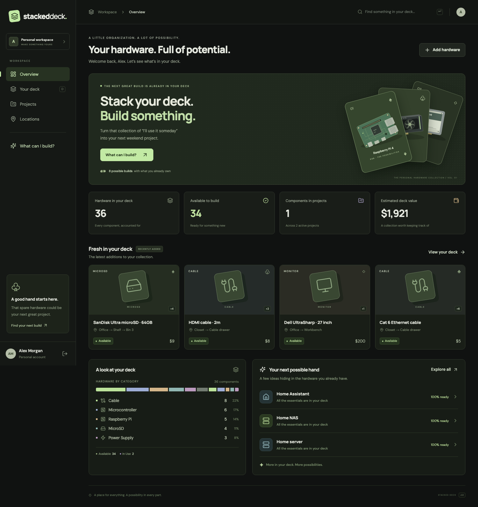

# Stacked Deck

**Know what you own. Find what you can build.**

A deployable personal hardware inventory and project workspace. A dark interface, a quiet card-deck motif, and a practical loop: **add hardware → organize it → choose a project → check your parts → reserve hardware**.



## Run locally

Use **Node 24 LTS** (Node 22.12+ is supported). The repository includes `.nvmrc`.

```sh
nvm install
nvm use
npm ci
cp .env.example .env
npm run db:migrate
npm run dev
```

Open **http://localhost:5173**. Create an account; new accounts start with an empty private deck. Shared project templates are installed automatically at API startup. Vite proxies `/api` to the Express server on port 3001.

For the populated development experience, set `SEED_PASSWORD` in `.env` to a password of at least 12 characters, then:

```sh
npm run db:seed
```

Sign in with `SEED_EMAIL` (default `demo@stackeddeck.local`) and your `SEED_PASSWORD`. Seeding never overwrites an existing account. The seed includes 16 hardware cards / 36 physical components, four locations, two projects, and all 11 templates. It includes the specified Raspberry Pis, NVIDIA GPUs (including an unavailable integrated laptop GPU), storage drives, networking, adapters, and microcontrollers. Never enable demo credentials on a public production deployment.

## AI hardware photos

Add `OPENAI_API_KEY` to your local `.env` or your deployment's server environment, then restart the app. Optionally set `OPENAI_VISION_MODEL` (default: `gpt-4.1-mini`). Keep the key on the server; do not prefix it with `VITE_`. API usage is billed to the configured OpenAI account. Without a key, manual inventory entry still works and the scan panel explains the missing setup.

In **Add hardware** or **Add computer**, choose **Take photo** (opens the camera on supported mobile browsers) or **Upload photo**, then **Scan photo**. Review the evidence, uncertainty, model and serial number. Choose **Use these details** to fill the main form, or **Add installed component** to add a detected part to the computer being created. Correct any mistakes before saving. Scanning alone creates no inventory records. Closed cases and unreadable labels cannot reliably reveal internal specifications.

JPEG, PNG and WebP uploads up to 20 MB are resized to at most 2048 pixels on their longest side and re-encoded as JPEG in the browser, omitting original EXIF metadata. The scan endpoint accepts images up to 4 MB and limits each signed-in user to 20 requests per hour per server process. Photos are sent to OpenAI only when Scan photo is pressed; Stacked Deck does not persist them. Requests use `store: false`. The integration uses the [Responses image input API](https://developers.openai.com/api/docs/guides/images-vision) with [structured output](https://developers.openai.com/api/docs/guides/structured-outputs), and validates suggestions before returning them.

Automated tests mock the AI provider and cover upload/review/save, installed parts, authentication, validation, limits, timeouts and failures. Live identification quality requires testing with your own API key and representative hardware photos.

If scanning returns a 429 error, the app distinguishes exhausted API credits, organization/project spend limits, approved usage limits and temporary rate limits. For exhausted credits, add credits in the [API billing settings](https://platform.openai.com/settings/organization/billing/overview) for the organization associated with your key. Billing and quota errors require credits or limit changes; repeated retries do not restore access. Temporary rate limits require spacing out scans. See the [OpenAI error guide](https://developers.openai.com/api/docs/guides/error-codes).

## Equipment valuations and portfolio

Photo scans now identify hardware **and propose an initial per-unit USD resale estimate in one request**. Review the range, confidence and explanation before using the suggestion. A low-confidence identification receives no price. Unusable valuation output is discarded without discarding valid identification. Manual entry also has an optional **Estimate value** action after entering the model, condition and specifications. AI failure never prevents saving equipment manually.

On a hardware detail screen, **Refresh valuation** generates a pending estimate. **Apply estimate** saves it as the current AI value. Refreshing alone never replaces the current value. Pending estimates remain available under valuation history. A changed model, condition, or installed component invalidates an older proposal. A saved manual value always takes priority, including `$0`; replacing it requires explicitly checking the replacement option. Clearing the manual override restores the latest accepted AI estimate, or leaves the item unvalued if none exists. Ordinary metadata edits preserve the value's source. Values and purchase prices remain per unit.

The dashboard shows current value, known purchase spend, dollar/percentage change, category values, the most valuable holding, and historical collection value. Missing values contribute zero to totals; coverage counts and a separate comparison of holdings with both prices prevent interpreting missing purchase prices as profit. Complete computers and their installed parts are counted once, using whole-computer prices when supplied and known part prices otherwise. Sold/Archived holdings are excluded. **Value my collection** opens a list of unpriced cards to work through individually; it never starts a bulk background job.

### Provider and limits

- Uses the existing server-only `OPENAI_API_KEY`. `OPENAI_VALUATION_MODEL` optionally selects the independent valuation model; it defaults to `OPENAI_VISION_MODEL`, then `gpt-4.1-mini`. Combined photo identification/valuation always uses `OPENAI_VISION_MODEL`.
- `server/valuation.ts` exposes `ValuationService.estimateEquipmentValue`, separate from transport and photo identification. The shared prompt considers known model/specifications, condition, age, purchase information, accessories in notes, and installed parts for saved computers. Notes and labels are treated as untrusted data.
- Requests use [Responses structured outputs](https://developers.openai.com/api/docs/guides/structured-outputs) and `store: false`. Zod additionally validates currency, integer cents, finite nonnegative prices, confidence, explanation length and ordered ranges.
- The initial provider has **no live marketplace comparables**. It must not claim recent sales or cite fabricated listings. Confidence is capped at medium; photo estimates assume untested used condition unless confirmed later. These are editable estimates, not appraisals or guaranteed sale prices.
- A request times out after 45 seconds. Independent valuations are limited to 20 attempts per signed-in user per hour, with one in-flight request per item and a one-minute cooldown after a saved AI proposal. Photo scans retain their separate 20/hour allowance. Controls are centralized in `shared/valuation.ts`; seven days marks a stale value in the UI, not an automatic refresh schedule. The rate limiter/in-flight guard are process-local, consistent with the current single-instance setup.
- Equipment details are sent only when the user requests a valuation. The independent provider omits serial numbers, image URLs, location and existing estimates. No scraping or marketplace API calls are implemented. Automated tests mock the provider and never make paid requests.

### Storage and historical semantics

Migration `003_valuations.sql` exists for both SQLite and Azure SQL. Startup applies it using the existing migration runner. It adds `aiValuation` (validated JSON), `manualValueOverrideCents` and `valuationUpdatedAt` to inventory; `estimatedValueCents` remains the effective current-value field for existing clients. Existing values become manual overrides, with baseline history dated at migration time, not retroactively at purchase time.

`equipment_valuations` stores each successful AI refresh, its model/provider, range, confidence, explanation, server timestamp, input fingerprint and optional application timestamp/effective value. A pending proposal does not affect totals. Accepting it is retry-safe; older records remain. Manual changes also append records. Owner/item composite foreign keys and an owner/item/date index follow existing repository conventions. Deleting hardware cascades its detailed valuation records.

`portfolio_value_events` stores only **changed per-item contributions**, in the same transaction as equipment/value/composition mutations. It is not a table of aggregate snapshots. Valuation records alone cannot reconstruct historical quantities, installations, archives or deletions; this small event ledger preserves those effects without copying entire portfolios. Historical item identifiers intentionally survive card deletion; events remain owner-scoped and cascade on user deletion. The migration records the starting holdings, and subsequent events never rewrite that baseline.

Portfolio history makes one ordered pass over the owner's indexed event stream, carries recorded values forward, and returns the last total for each UTC day with activity plus today's total. The lightweight SVG step charts include an accessible value table and add no chart dependency. No values are fabricated before tracking starts. Collection changes affect the chart, so it is **not a time-weighted investment return**. For very long histories, range queries with a SQL opening balance and monthly sampling can replace the in-memory pass without changing the event model.

Authenticated operations follow the existing `/api` conventions:

| Operation                                 | Route                                                                           |
| ----------------------------------------- | ------------------------------------------------------------------------------- |
| Preview an unsaved item                   | `POST /api/hardware/valuation`                                                  |
| Generate and retain a pending estimate    | `POST /api/inventory/:id/valuation`                                             |
| Apply a reviewed estimate                 | `PUT /api/inventory/:id/valuation` with `valuationId`, optional `replaceManual` |
| Set/clear a manual override               | `PUT /api/inventory/:id/manual-value` with nullable `valueCents`                |
| Item history, including pending estimates | `GET /api/inventory/:id/valuations`                                             |
| Totals, breakdown and history             | `GET /api/portfolio/valuation`                                                  |
| Historical total values                   | `GET /api/portfolio/valuation-history`                                          |

Next accuracy improvements: add authorized sold-listing APIs through the provider interface, normalize exact SKUs/specifications and condition, record comparable sale dates/locations, and calibrate ranges against actual sales. Multi-currency conversion, automated refresh scheduling and realized sale proceeds are not part of this first version.

## What works

- Account creation, sign in/out, protected API routes, private per-user workspaces, persistent 30-day sessions.
- Inventory creation, details, edits, archive/restore and deletion. Quantities, condition, base status, manufacturer, model, per-unit purchase/current values, purchase date, serial, notes, tags and optional image URL.
- Complete computer catalog: desktops, laptops, mini PCs, servers and all-in-ones; prebuilt/custom build origin; processor, graphics, RAM, storage, motherboard, power supply and OS specifications. When creating a computer, enter installed components directly: each component name reveals another optional input below. The computer and its new parts save together, with all entered quantities installed. Existing parts can also be linked from your deck with quantity limits and cannot be double-booked for projects.
- AI photo identification: take a photo on a supported phone or upload an image in Add hardware / Add computer. Scan visible hardware and labels, review the suggestions, then fill a hardware form or add installed components before saving.
- Custom categories and tags. Search across names, manufacturer, model, serial, notes and tags. Category, status, location and tag filters, paging, grid/list views.
- Location management with descriptive paths such as `Office → Shelf → Bin 3`. Deleting a location clears the location reference without deleting its hardware.
- Dashboard with physical quantities, availability, assigned units, a valuation portfolio with historical charts and category values, recent additions, status breakdown and recommendations.
- Project CRUD, statuses, descriptions, notes, cost estimates, required/optional components and a live compatibility checklist.
- Explicit, quantity-based inventory assignments. A project displays its hardware; each hardware card links back to its projects. Transactional allocation prevents overbooking.
- Eleven shared templates: NAS, Pi-hole, RetroPie-style gaming, home server, Home Assistant, media server, Minecraft server, Pi cluster, network monitoring, development server and local AI workstation.
- Recommendations show matched hardware, missing quantities, optional matches, readiness and additional purchase estimates. Creating a project from a template copies its requirements; it does not silently reserve components.
- Responsive layouts, native modal focus handling, validation/error feedback, loading/empty states, reduced motion support, locally served fonts and custom SVG category illustrations.

## Architecture and boundaries

| Layer          | Technology / responsibility                                                                                     |
| -------------- | --------------------------------------------------------------------------------------------------------------- |
| Browser        | React 19, React Router, TypeScript, Vite, Lucide icons, plain CSS                                               |
| HTTP API       | Express 5; explicit authenticated JSON routes; shared Zod validation                                            |
| Data           | SQLite locally; Azure SQL for Azure hosting; foreign keys and versioned transactional migrations                |
| Authentication | Asynchronous scrypt password hashing, provider-neutral identities, hashed random session tokens in the database |
| Matching       | Pure deterministic integer-capacity matching; independent of HTTP and persistence                               |
| Delivery       | One Node process serves the built client and API; Docker image and Compose example included                     |

The user ID comes exclusively from the authenticated session. Owner-scoped repository queries and composite ownership foreign keys protect references between inventory, locations, projects, tags and assignments. Money is stored as integer USD cents; inventory values and purchase prices are **per unit**. Dashboard valuation multiplies current value by quantity and excludes Sold/Archived items; unpriced items contribute zero.

SQLite keeps the MVP simple and is intended for **one application instance with a persistent local disk**. Indexed ownership/status/category/location queries isolate users. Inventory filter hydration currently loads one user's deck before filtering/paging, which is appropriate for hundreds of cards but should move into indexed SQL/FTS for very large individual decks. Use the shared Azure SQL backend and a distributed rate-limit store before scaling to multiple application servers. WAL permits concurrent reads but SQLite still serializes writers; see [SQLite WAL documentation](https://www.sqlite.org/wal.html).

### Schema

- `users`: profile and unique normalized email.
- `identities`: user, provider, provider subject, optional password hash. The schema can accommodate OAuth identities; no OAuth providers are implemented yet.
- `sessions`: hashed token, user and expiry. Cookies are HTTP-only, SameSite=Lax, and Secure in production. Tokens rotate on sign in; logout revokes the server session.
- `categories`, `tags`: per-user vocabulary; `item_tags` connects cards to tags.
- `locations`: per-user descriptive storage locations.
- `inventory_items`: hardware fields and owner/category/location relationships; component/system kind and optional structured computer specifications.
- `system_components`: owner-constrained links from complete computers to installed inventory parts and quantities.
- `projects`, `project_requirements`: private build plans and editable criteria.
- `project_assignments`: owner-constrained project/item relationship with allocated quantity.
- `project_templates`, `template_requirements`: shared build recipes, installed idempotently at startup.
- `schema_migrations`: records applied SQL migrations.

Requirement categories/tags are small JSON arrays inside otherwise relational requirement rows. Categories are OR alternatives; tags are AND constraints. When both are present, a card must satisfy the category and all tags. Tag-only requirements support arbitrary accessories. Template edits belong in `server/templates.ts`; startup updates shared templates, leaving users' copied projects unchanged.

### Reservation semantics

- `Available` is the allocatable base status. Other base statuses have zero available quantity.
- Available units = total quantity − project assignments − installed units.
- Each complete computer is a separate card with quantity 1. Its specs can be recorded without creating individual part cards.
- Linked parts remain in your inventory. Removing a part or deleting its computer releases installed quantities; a computer assigned to a project must be released before changing its installed parts.
- A computer’s declared value includes its parts. When no whole-computer value is set, the dashboard uses the sum of linked part values; installed units are excluded from separate component valuation.
- Archive/sell a complete computer to exclude its whole value and its installed parts from the deck valuation. Installed parts remain unavailable until explicitly removed or the computer is deleted.
- Idea/Planning/Ready assignments display as Reserved. In Progress/Complete assignments display as In Use.
- Completing a build keeps its parts in use. Abandoning or deleting a project releases its assignments.
- Release can also be done explicitly from the project's hardware list.
- Assigned cards cannot be archived, deleted, marked unusable, or reduced below the allocated quantity until the affected assignments are released.
- Each recommendation is an **independent alternative** using the current available deck. Parts can appear in different recommendations, but a physical unit is never counted twice within one recommendation.
- Matching uses bipartite capacity flow to resolve overlapping requirements, matching required units before optional units. It maximizes covered quantities, then estimates the missing hardware; it does not optimize the monetary cost of alternative component allocations.
- A project's checklist includes its own allocated hardware plus currently available hardware. A match in the checklist is not itself a reservation.

### Important files

| File                                                                                                       | Purpose                                                           |
| ---------------------------------------------------------------------------------------------------------- | ----------------------------------------------------------------- |
| `shared/types.ts`, `shared/validation.ts`                                                                  | API contracts, enums, validation                                  |
| `migrations/001_initial.sql`                                                                               | Tables, ownership constraints and indexes                         |
| `server/db.ts`                                                                                             | Database configuration and transactional migrations               |
| `server/auth.ts`                                                                                           | Password identities and session lifecycle                         |
| `server/store.ts`, `server/sqlite-store.ts`, `server/sqlserver-store.ts`, `server/sqlserver-repository.ts` | Provider contract and Azure SQL persistence                       |
| `server/repository.ts`                                                                                     | Owner-scoped persistence and reservation invariants               |
| `server/app.ts`                                                                                            | API routes, validation, CSRF defense, security headers and errors |
| `server/compatibility.ts`                                                                                  | Pure matching and ranking engine                                  |
| `server/templates.ts`, `server/seed.ts`                                                                    | Build recipes and optional demo data                              |
| `src/App.tsx`, `src/pages/`                                                                                | Authentication, workspace shell and application screens           |
| `src/components/`, `src/styles.css`                                                                        | Shared forms, dialog, hardware art and responsive UI              |
| `tests/`                                                                                                   | API integration, matching and browser workflow tests              |
| `docs/IMPLEMENTATION.md`                                                                                   | Original implementation plan and boundaries                       |

## Environment

| Variable                                  | Default                                | Purpose                                                                           |
| ----------------------------------------- | -------------------------------------- | --------------------------------------------------------------------------------- |
| `NODE_ENV`                                | `development`                          | Set `production` for secure cookies and static client serving                     |
| `PORT`                                    | `3001`                                 | Express port; the dev proxy assumes 3001                                          |
| `APP_ORIGIN`                              | `http://localhost:5173` in development | Exact trusted origin, without trailing slash. Required HTTPS origin in production |
| `DATABASE_PROVIDER`                       | `sqlite`                               | `sqlite` for local disk, `sqlserver` for Azure SQL                                |
| `AZURE_SQL_SERVER` / `AZURE_SQL_DATABASE` | none                                   | Required for Azure SQL; connections use Azure identity                            |
| `DATABASE_PATH`                           | `./data/stacked-deck.db`               | Persistent SQLite file                                                            |
| `TRUST_PROXY`                             | `0`                                    | Trusted reverse proxy hops; typically `1` behind one proxy                        |
| `SEED_EMAIL`                              | `demo@stackeddeck.local`               | Optional demo account email                                                       |
| `SEED_PASSWORD`                           | none                                   | Required only for creating the optional demo account                              |

No application signing secret is required: sessions use cryptographically random 256-bit tokens; only their SHA-256 hashes are stored. Keep `.env`, database files and backups private. `.gitignore` and `.dockerignore` exclude local secrets/data.

## Checks

```sh
npm run typecheck
npm run lint
npm run format:check
npm test
npx playwright install chromium
npm run test:e2e
npm run build
```

Unit and integration tests use in-memory databases. Playwright starts an isolated local server on ports 5179/3179 and uses `data/e2e.db`, so other projects running on the default development port cannot intercept the tests. It creates disposable accounts and hardware. `PLAYWRIGHT_BASE_URL` targets a deployed server instead.

The API suite covers account isolation, invalid cross-user references, credential/session hashing, CSRF rejection, input validation, filters, lifecycle behavior, and allocation limits. The matching suite covers quantity, overlap, specialist constraints, optional components, tag-only criteria, availability and ranking. Browser tests cover registration, locations, adding hardware, template matching, project creation, reservation, reload persistence, mobile layout and logout, plus computer creation, specifications, installed parts, edits and returning parts to the available deck.

See [verification notes](docs/VERIFICATION.md) for the completed run and deployment limits.

## Free Azure deployment

Use **App Service F1 + Azure SQL’s free offer**, with database overage billing disabled. The app includes an Azure SQL backend and repeatable deployment scripts. See [the Azure deployment guide](docs/AZURE.md) for the command, quota limits, managed identity, firewall setup and operational guidance. Local development still uses SQLite.

## Production deployment

```sh
npm ci
npm run build
NODE_ENV=production APP_ORIGIN=https://deck.example.com TRUST_PROXY=1 npm start
```

Run from the project root so `migrations/` and `dist/client/` resolve. Terminate TLS with a reverse proxy such as Caddy/nginx and forward to port 3001. Set `TRUST_PROXY` to the actual proxy topology; do not broadly trust arbitrary forwarded headers. Health is available at `/api/health`. Startup applies pending migrations and refreshes shared templates. SIGINT/SIGTERM close the HTTP server and database.

Or use Docker Compose behind an HTTPS proxy:

```sh
APP_ORIGIN=https://deck.example.com docker compose up --build -d
```

The image runs as the unprivileged `node` user, binds the host port to loopback, and keeps its database in a named volume. Ensure the proxy is the only public entry point. Do not use an ephemeral/serverless filesystem or a shared network filesystem for this database. Do not launch multiple replicas with this SQLite setup. The Docker image has been built and smoke-tested locally; validate your own TLS proxy and persistent-volume setup before releasing publicly.

### Backup and restore

Use SQLite's online backup API, which safely includes committed WAL data:

```sh
npm run db:backup -- ./backups/stacked-deck-2026-09-28.db
```

In the production image (no development dependencies):

```sh
node --env-file-if-exists=.env dist/server/backup.js /app/data/backups/stacked-deck.db
```

Use a **new destination filename** for each backup. Store encrypted copies off-host and test restores. A backup inside the same volume is not disaster recovery. Before restoring, stop the application, preserve the existing database **and its WAL/SHM files**, then restore the backup at `DATABASE_PATH` with appropriate ownership. Do not copy only a live `.db` file while WAL writes are active. Back up before applying new migrations; migrations are forward-only.

### Current boundaries

Readiness is a category/tag check, **not proof of electrical or software compatibility**. Templates cannot yet validate wattage, physical fit, interfaces, minimum RAM/VRAM, drive connectivity counts, or exact software support. Costs are rough editable USD estimates, not live prices. Photo URLs are displayed directly; uploaded scan images are analyzed but not persisted. Images contact the supplied external host (without a referrer). Artwork without a photo is illustrative by category.

Authentication has rate limiting, generic login failures, scrypt, secure production cookies, same-origin write checks and JSON/custom-header CSRF protection. Email verification, recovery, MFA, OAuth, account deletion and session management screens are not part of this MVP. Public self-registration is enabled. Decide on registration policy and implement email recovery before opening a broad public service. The auth limiter is process-local, consistent with the single-instance deployment.

## Recommended next five features

1. **Account recovery and verification:** verified emails, password reset, session/device management, and OAuth.
2. **Portable inventories:** CSV/JSON import, export, bulk edits and deduplication.
3. **Specification-aware matching:** RAM, VRAM, connector types, power budgets and embedded capabilities.
4. **QR labels and mobile capture:** camera uploads, labels for bins/cards, and photo-assisted entry.
5. **Reusable build recipes:** user-authored templates, build steps, compatibility notes and optional sharing.
